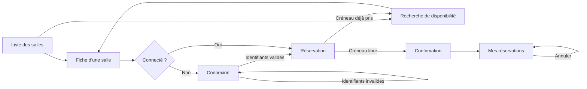
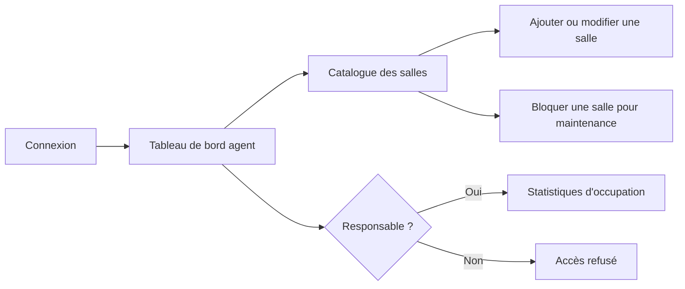

# Enchaînement des écrans

## Parcours usager

```mermaid
flowchart LR
    A[Liste des salles] --> B[Fiche d'une salle]
    A --> C[Recherche de disponibilité]
    C --> B
    B --> D{Connecté ?}
    D -- Non --> E[Connexion]
    E -- Identifiants valides --> F[Réservation]
    E -- Identifiants invalides --> E
    D -- Oui --> F
    F -- Créneau libre --> G[Confirmation]
    F -- Créneau déjà pris --> C
    G --> H[Mes réservations]
    H -- Annuler --> H
```

## Parcours agent et responsable

```mermaid
flowchart LR
    A[Connexion] --> B[Tableau de bord agent]
    B --> C[Catalogue des salles]
    C --> D[Ajouter ou modifier une salle]
    C --> E[Bloquer une salle pour maintenance]
    B --> F{Responsable ?}
    F -- Oui --> G[Statistiques d'occupation]
    F -- Non --> H[Accès refusé]
```
